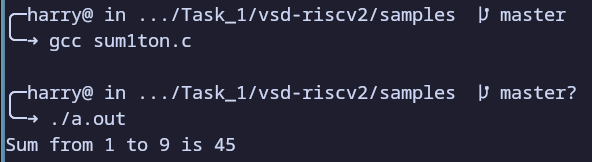
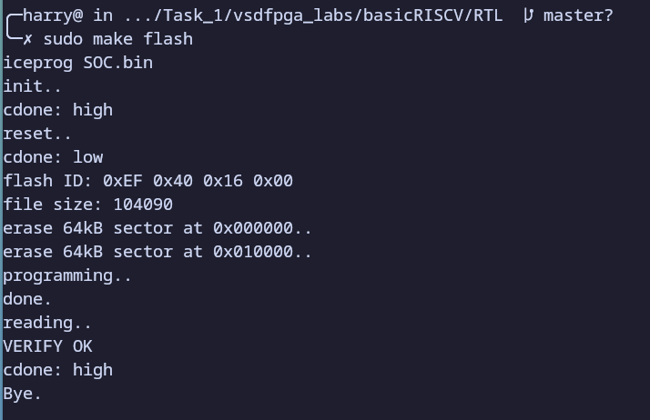
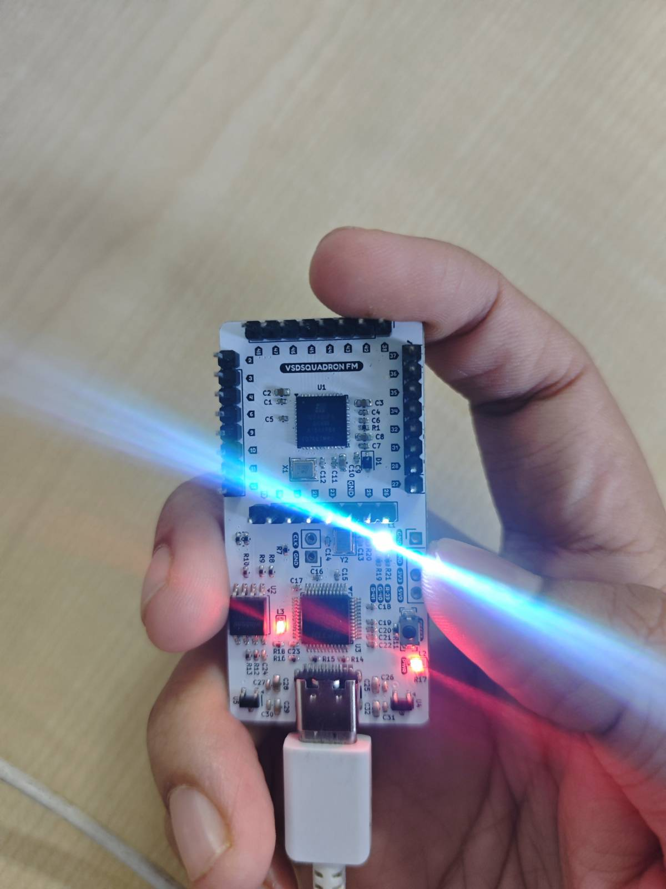

# Task 1: Environment Setup & RISC-V Reference Bring-Up

## Overview
This task involved setting up the RISC-V development environment natively on Arch Linux and performing a hardware check using the VSDSquadron FPGA Mini board. The goal was to verify the toolchain, compile a reference firmware, and flash it onto the FPGA-based RISC-V SoC.

## Environment Details
- **Operating System:** Arch Linux (Native) and Codespaces (both)
- **Toolchain:** `riscv64-elf-gcc` (note that the instructions for Codespaces used riscv64-unknown-elf-gcc)
- **Hardware:** VSDSquadron FPGA Mini 
- **Simulation/Utilities:** Icarus Verilog, GTKWave, `iceprog`, `picocom`

## Understanding Check
### 1. Where is the RISC-V program located in the `vsd-riscv2` repository?
In the `vsd-riscv2` repository, the RISC-V programs are located in the **`samples/`** directory. This folder contains C source files **`sum1ton.c`**, which are designed to be executed on the RISC-V architecture.

### 2. How is the program compiled and loaded into memory?
The program is compiled using the **RISC-V GCC toolchain**. For hardware execution, the resulting ELF binary is converted into a **`.hex`** file format using a firmware utility and then loaded into the FPGA's **Block RAM (BRAM)** during the flashing process via `iceprog`.

### 3. How does the RISC-V core access memory and memory-mapped IO?
The RISC-V core utilizes **Memory-Mapped I/O (MMIO)**, where both physical memory (RAM) and hardware peripherals (UART, LEDs) share the same address space. The core uses standard **Load (`lw`) and Store (`sw`)** instructions to interact with hardware.

### 4. Where would a new FPGA IP block logically integrate in this system?
A new IP block would logically integrate as a peripheral on the **Internal System Bus**. It would be assigned a **unique, non-overlapping address range** within the memory map. The RISC-V core would then communicate with this new IP by reading from or writing to those specific memory addresses.

## Evidence of Completion
### Compiler Setup and Codespaces
The Codespace is setup and all the instructions in the repo README is followed which include GUI Desktop setup. In addition to that the repo is cloned to local system and all programs are tested with an additional factorial finder program as well. All terminal outputs are attached below.

**sum1ton.c using riscv64-elf-gcc**

**sum1ton.c using gcc**

**factorial.c using riscv64-elf-gcc**

### Hardware Flash
The following output confirms the successful flashing of the bitstream and the execution of the firmware (indicated by the White RGB LED state on the board).In order for Makefile to compile I had to make some changes to Makefile and print.c in Firmware folder.

**make flash terminal out**

**Flashed FPGA**

**make terminal output**
This command was working and the terminal was waiting for reply from fpga and somehow I was not getting any.

